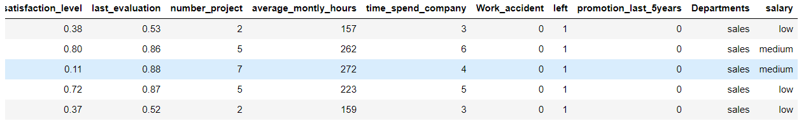
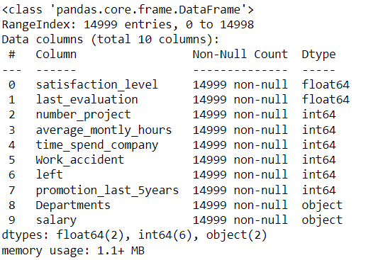
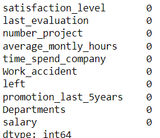
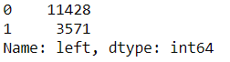
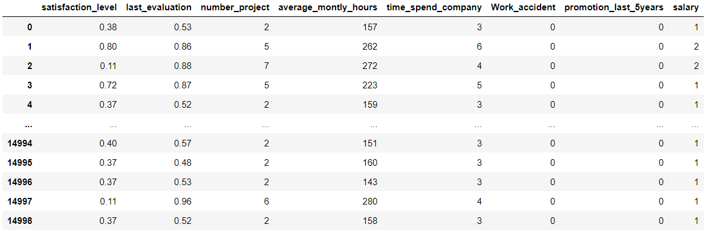
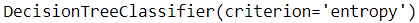
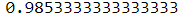
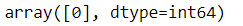

<h3>Date:</h3>
<h2>Exp: 06</h2>

# Implementation of Decision Tree Classifier Model for Predicting Employee Churn

## AIM:
To write a program to implement the Decision Tree Classifier Model for Predicting Employee Churn.

## Equipments Required:
1. Hardware – PCs
2. Anaconda – Python 3.7 Installation / Jupyter notebook

## Algorithm
1. Import the library and read the dataset.
2. Train and test the model
3. Predict the values
4. End the program

## Program:

Program to implement the Decision Tree Classifier Model for Predicting Employee Churn.

Developed by: Sabari Akash A

RegisterNumber: 212222230124 

```py
import pandas as pd
data=pd.read_csv('/content/Employee.csv')
data.head()

data.info()

data.isnull().sum()

data["left"].value_counts()

from sklearn.preprocessing import LabelEncoder
le= LabelEncoder()
data["salary"]=le.fit_transform(data["salary"])
data.head()

x= data[["satisfaction_level","last_evaluation","number_project","average_montly_hours","time_spend_company","Work_accident","promotion_last_5years","salary"]]
x.head()
y=data["left"]
x

from sklearn.model_selection import train_test_split
x_train,x_test,y_train,y_test = train_test_split(x,y,test_size=0.2,random_state = 100)

from sklearn.tree import DecisionTreeClassifier
dt = DecisionTreeClassifier(criterion="entropy")
dt.fit(x_train,y_train)

y_pred = dt.predict(x_test)
from sklearn import metrics

accuracy = metrics.accuracy_score(y_test,y_pred)
accuracy

dt.predict([[0.5,0.8,9,260,6,0,1,2]])
```
## Output:
















## Result:
Thus the program to implement the  Decision Tree Classifier Model for Predicting Employee Churn is written and verified using python programming.
